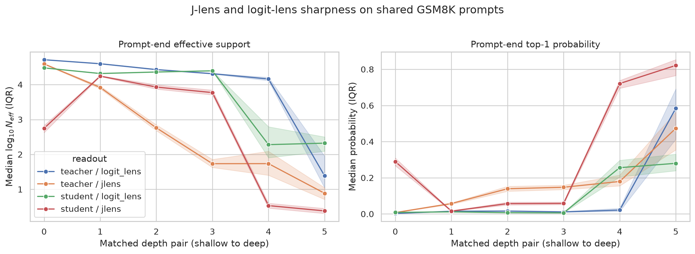
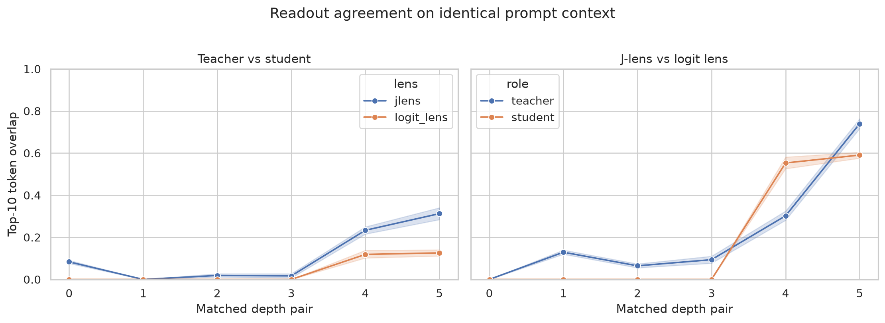
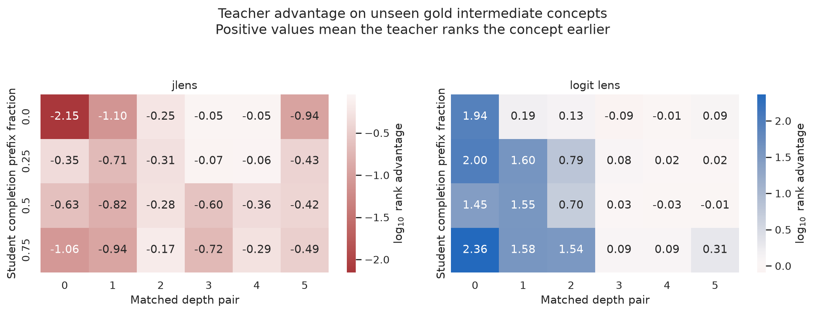
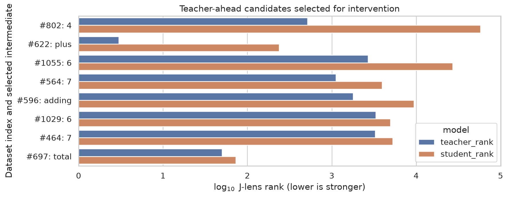
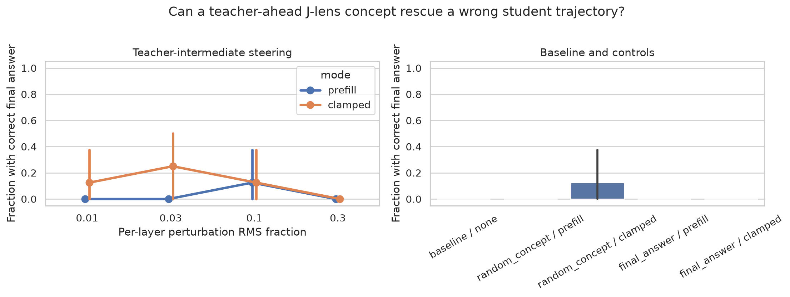
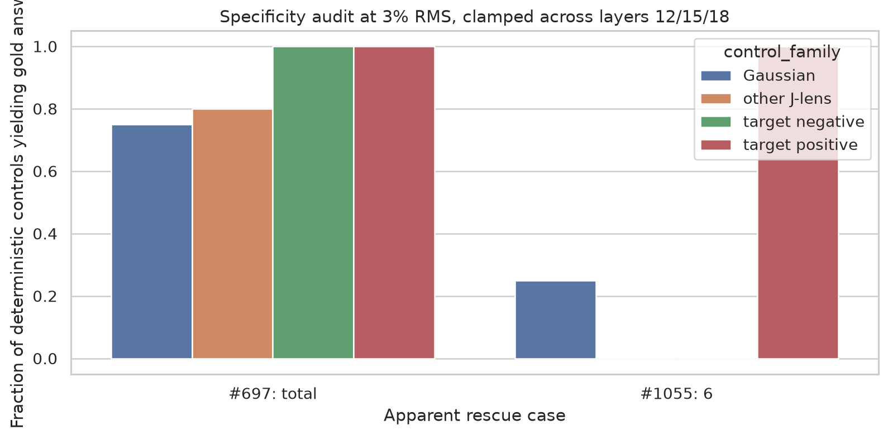

# Teacher / student lens concept 注入 case study

日期：2026-07-14

## 1. 结论先行

这次 case study **不支持现在就把 teacher J-lens 的 top tokens 做成 sparse auxiliary
classification task**。

最重要的结果是：

1. teacher 和 student 在相同 context 上确实读出了很不一样的词表，但其中相当一部分
   是模型和 prompt template 特异的，而不是题目特异的。student J-lens 在六组配对深度
   中有三组对全部 96 道题给出同一个 top-1 token，另两组也分别有 93/96 和 91/96
   相同。一个分布可以非常尖锐，却只是在尖锐地表示“现在要开始解题”，而不是某道题的
   有效 concept。
2. 在从 gold rationale 提取的、尚未出现在 prefix 中的 oracle 中间 concept 集合上，
   teacher J-lens 并没有系统性地早于 student 看见 concept。四个时间点、六组深度的
   teacher rank advantage 中位数全部为负。反而是浅层 teacher logit lens 的 oracle
   rank advantage 明显更强，尽管它的 raw top tokens 经常不可解释。
3. 17 道 teacher 对、student 错的题中，只有一个足够明确且 teacher-specific 的
   candidate：`plus`，teacher J-lens rank 3、student rank 237。其他入选 candidate
   大多位于 teacher rank 514--3311，概率只有 $10^{-6}$ 到 $10^{-4}$。top-1 或 top-2
   gate 一个也选不出来；top-100 只留下 `plus` 和 `total`，而 `total` 在
   student 中本来已经是 rank 73。
4. 将这些 candidate 以 additive writing 的方式注入 student 后，八个 case 中表面上
   有两个答案被 rescue。matched controls 完全否定了其中一个：反向 target、4/5 个
   无关 J-lens direction、3/4 个 Gaussian direction 都能得到同一个正确答案。另一个
   对 target 正方向更敏感，但 completion 同时推导出互相冲突的答案，并且依赖截断和
   decode setup，不能算干净的因果 rescue。
5. 大强度注入有明显的 motor contamination：30% hidden RMS 的数字 direction 经常
   导致 `777...`、`444...` 或 `666...`。改变最终文本远比把一个能被下游正确
   使用的 concept 写入模型容易。

因此，**raw J-lens sharpness 不能单独作为 gate**。现有数据也尚未提供一个能稳定修复
student trajectory 的 teacher-only concept。下一步更值得做的是构造带明确 single-token
source / target intermediate 的受控题目，使用 Anthropic 的 coordinate swap，并从一开始
就加入正负方向和 matched-random controls；在此之前不应把 sparse concept loss 加进
trainer。

## 2. 问题与实验协议

本实验回答四个问题：

1. 在完全相同的 context 上，teacher 和 student 的 J-lens / logit lens 是否不同？
2. teacher J-lens 分布尖锐时，信号是否真的与当前题目有关？
3. 对 teacher 做对、student 做错的题，teacher 是否更早暴露 gold intermediate？
4. 把该 intermediate 写进 student J-space 后，student 是否会由于这个 concept 而答对？

### 2.1 模型、数据和生成设置

| 项目 | 设置 |
|---|---|
| 数据 | GSM8K test 中按 seed 42 固定抽取的 96 道题 |
| Teacher | `Qwen/Qwen3.5-9B` |
| Student | `Qwen/Qwen3.5-2B` |
| Prompt | round-2 原样的 four-shot eval prompt；无 system prompt；关闭 thinking |
| Decode | greedy，最多 768 个 completion tokens |
| Teacher J-lens | `/gdata/users/duanyll/jlens/qwen3p5_9b_v2/lens.pt` |
| Student J-lens | `/gdata/users/duanyll/opdlens/artifacts/qwen3p5-2b-jlens-cot-ext.pt` |
| 配对层 | student / teacher：6/8、9/12、12/16、15/20、18/24、21/28 |

这里使用的是未经过 lens supervision 的 base teacher 和 student，不是某个实验 arm 的
checkpoint。没有修改 eval prompt、grader、metric 或 schedule。

teacher 和 student 先各自生成完整回答。之后只在严格共享的 token context 上计算
readout：

- 对全部 96 道题，在 prompt end 读取；
- 对 teacher-correct / student-wrong case，再取 student 错误 completion 的 25%、50%、
  75% checkpoint。

后一种情况下，两个模型收到完全相同的 prompt 加 student-generated prefix，避免把两者
已生成文本的差异误当成 lens 差异。

### 2.2 答题结果

| Outcome | 数量 |
|---|---:|
| teacher、student 都对 | 67 |
| teacher 对、student 错 | 17 |
| 两者都错 | 11 |
| student 对、teacher 错 | 1 |
| **总计** | **96** |

teacher accuracy 为 87.5%，student accuracy 为 70.8%。

### 2.3 如何定义中间 concept

为了避免在看到结果后主观挑选好看的 top tokens，candidate 从 GSM8K gold rationale
机械提取：

- rationale 中出现、但尚未出现在共享 prefix 中的数值 intermediate；
- `plus`、`adding`、`total` 等少量运算词 whitelist；
- 只保留 tokenizer 下的 single-token variant；
- final gold answer 不作为 intermediate candidate。

这是一个使用 gold rationale 的 **oracle diagnostic**，不是可直接部署的 selector。
它问的是“理想目标在 ranking 中是否存在”，已经比真实 training-time gate 更有利。

数值规范化有一个已知 false positive：dataset index 802 的题面包含单词 `four`，
rationale 使用数字 `4`，简单 matcher 将 `4` 误认为未出现。报告保留该 candidate，
以免掩盖 selection pipeline 的这个失败。

## 3. Lens 分布有多明确？

对于 lens distribution $p$，定义：

$$
H(p) = -\sum_v p(v) \log p(v),
$$

$$
N_{\mathrm{eff}} = \exp(H(p)).
$$

较小的 $N_{\mathrm{eff}}$ 或较大的 top-1 probability 表示分布尖锐，但不代表 top
token 是 task-relevant concept。

prompt end 的 J-lens 中位数如下：

| 配对深度 | Teacher $p_1$ | Teacher $N_{\mathrm{eff}}$ | Student $p_1$ | Student $N_{\mathrm{eff}}$ |
|---:|---:|---:|---:|---:|
| 0 | 0.0075 | 39,023 | 0.290 | 561 |
| 1 | 0.0576 | 8,285 | 0.0158 | 17,499 |
| 2 | 0.139 | 578 | 0.0571 | 8,498 |
| 3 | 0.148 | 54 | 0.0582 | 5,902 |
| 4 | 0.179 | 55 | 0.721 | 3.42 |
| 5 | 0.473 | 7.70 | 0.822 | 2.41 |

student 在后层看起来非常“自信”，但实际 top tokens 揭示了这种置信度的问题：

| Role / lens | Pair 0 | Pair 1 | Pair 2 | Pair 3 | Pair 4 | Pair 5 |
|---|---|---|---|---|---|---|
| Student J-lens top-1 mode | `−` 96/96 | `urada` 94/96 | `推理` 93/96 | `解题` 91/96 | `Here` 96/96 | `To` 96/96 |
| Teacher J-lens top-1 mode | `步` 96/96 | `文本` 57/96 | ` Calculation` 90/96 | `Step` 62/96 | `Step` 50/96 | ` reasoning` 83/96 |
| Student logit-lens mode | `ubat` 82/96 | `ulo` 53/96 | `掖` 45/96 | `就绪` 54/96 | `Here` 96/96 | `To` 65/96 |
| Teacher logit-lens mode | `晏` 96/96 | `逻辑` 92/96 | `理` 96/96 | `解答` 81/96 | ` step` 72/96 | ` reasoning` 91/96 |

占主导的 J-lens 内容主要是稳定的 prompt template / generic computation mode。最直接的
反例是 student pair 4：median $p_1 = 0.721$，但 96 道题的 top-1 全部是 `Here`。
若使用 $p_1 > 0.5$，gate 会在每道题上都非常自信地接受一个无区分度的 label。

## 4. Teacher 和 student 看见的是同一批东西吗？

对 top-10 sets $T_t$ 和 $T_s$，定义：

$$
O_{10} = \frac{|T_t \cap T_s|}{10}.
$$

从浅到深，teacher / student J-lens 的平均 overlap 为：

$$
(0.083,\ 0.000,\ 0.019,\ 0.017,\ 0.233,\ 0.313).
$$

logit lens 对应为：

$$
(0.000,\ 0.000,\ 0.000,\ 0.000,\ 0.119,\ 0.126).
$$

早层和中层的 readout vocabulary 几乎不相交，只在靠近输出时部分收敛。这说明直接匹配
teacher / student vocabulary distribution，确实在要求 student 复现 model-specific
observer coordinates；但它并不能证明 teacher 独有的 coordinate 更像有效 task concept。

## 5. Teacher 是否更早暴露 gold intermediate？

对于每个尚未出现的 gold-rationale concept，取其最佳 tokenizer variant，定义 teacher
rank advantage：

$$
A = \log_{10}(r_s + 1) - \log_{10}(r_t + 1),
$$

其中 $r_t$ 和 $r_s$ 分别是 teacher、student rank。$A > 0$ 表示 teacher 排得更靠前。

各组中位数如下：

| Lens / student completion fraction | Pair 0 | Pair 1 | Pair 2 | Pair 3 | Pair 4 | Pair 5 |
|---|---:|---:|---:|---:|---:|---:|
| J-lens / 0% | -2.15 | -1.10 | -0.25 | -0.05 | -0.05 | -0.94 |
| J-lens / 25% | -0.35 | -0.71 | -0.31 | -0.07 | -0.06 | -0.43 |
| J-lens / 50% | -0.63 | -0.82 | -0.28 | -0.60 | -0.36 | -0.42 |
| J-lens / 75% | -1.06 | -0.94 | -0.17 | -0.72 | -0.29 | -0.49 |
| Logit lens / 0% | 1.94 | 0.19 | 0.13 | -0.09 | -0.01 | 0.09 |
| Logit lens / 25% | 2.00 | 1.60 | 0.79 | 0.08 | 0.02 | 0.02 |
| Logit lens / 50% | 1.45 | 1.55 | 0.70 | 0.03 | -0.03 | -0.01 |
| Logit lens / 75% | 2.36 | 1.58 | 1.54 | 0.09 | 0.09 | 0.31 |

J-lens 的 24 个 cell 中位数全部为负；表现最好的 cell 也只有 5/12 个 concept 是 teacher
领先。相反，在 completion 25%、50%、75% 时，前 3 组浅层 teacher logit lens 对几乎
所有 oracle concept 都领先。

这不意味着 raw logit-lens top tokens 可以直接当 label；前面的 modal-token table 已经
说明它们经常不可解释。但这说明 teacher hidden state 中存在与 oracle target 相关的
separation，而当前 J-lens ranking 没有把它读好。不能只因为 J-lens top tokens 更像自然
语言，就默认它一定是更好的 concept detector。

## 6. Teacher-only case 中实际找到了什么？

为了在整体弱信号下仍然构造一组 intervention，使用了很宽松的条件：teacher 对 /
student 错、concept 尚未出现、teacher J-lens rank 优于 student、teacher rank 不超过
5000。得分最高的八个 candidate 是：

| Dataset index | Concept | Context | Student / teacher layer | Teacher rank | Student rank | Teacher probability |
|---:|---|---:|---:|---:|---:|---:|
| 802 | `4` | 25% | 18 / 24 | 514 | 58,051 | $6.93 \times 10^{-5}$ |
| 622 | `plus` | 75% | 12 / 16 | 3 | 237 | 0.1086 |
| 1055 | `6` | 75% | 12 / 16 | 2,696 | 27,112 | $2.49 \times 10^{-6}$ |
| 564 | `7` | 75% | 12 / 16 | 1,121 | 3,962 | $1.56 \times 10^{-5}$ |
| 596 | `adding` | 50% | 12 / 16 | 1,786 | 9,391 | $2.27 \times 10^{-5}$ |
| 1029 | `6` | 25% | 12 / 16 | 3,311 | 4,951 | $1.06 \times 10^{-5}$ |
| 464 | `7` | 50% | 12 / 16 | 3,283 | 5,282 | $6.12 \times 10^{-6}$ |
| 697 | `total` | 25% | 12 / 16 | 50 | 73 | 0.00213 |

只有 `plus` 同时满足高 rank 和明显 teacher-specific。`total` 在两个模型中都相对
靠前；另外六个只是 vocabulary-tail hypothesis，而不是明确 concept。把这八个都称作
“teacher concept”已经很宽松，后续 intervention 是在测试：即使 oracle-assisted
selection 放宽到这个程度，能否找到因果信号。

## 7. 注入方法

Anthropic 使用 column-vector notation 定义 J-lens readout：

$$
\operatorname{lens}(h_\ell)
=
\operatorname{softmax}\!\left(W_U\,\operatorname{norm}(J_\ell h_\ell)\right).
$$

layer $\ell$ 上 token $t$ 的 J-lens direction 是 $W_U J_\ell$ 的对应行：

$$
v_{\ell,t}
=
J_\ell^\top W_U[t,:]^\top.
$$

他们最简单的 writing 操作是 positive steering：
$h \leftarrow h + \alpha v_{\ell,t}$。而论文中最强的 internal-reasoning 实验使用的是：
在全部 token positions 上 clamped，将 source concept 与 counterfactual target concept
做 coordinate swap。原文见 [technical details](https://transformer-circuits.pub/2026/workspace/index.html#methods-technical-details)
和 [internal reasoning experiments](https://transformer-circuits.pub/2026/workspace/index.html#ws-reasoning)。

本实验测试的是其中最简单的 **positive writing**，因为这些失败的 student trajectory
通常没有暴露一个干净、同类的 wrong source concept 可供替换。teacher 只提供 token
identity $t$。teacher 与 student 的 hidden dimension 和 coordinate system 不同，所以
绝不直接复制 teacher vector，而是把 token 转成 student 自己的 J direction：

$$
\hat v^{(s)}_{\ell,t}
=
\frac{(J^{(s)}_\ell)^\top W_U^{(s)}[t,:]^\top}
{\left\|(J^{(s)}_\ell)^\top W_U^{(s)}[t,:]^\top\right\|_2}.
$$

在 student layers 12、15、18 上施加：

$$
h'_{\ell,i}
=
h_{\ell,i}
+
\alpha \left\|h_{\ell,i}\right\|_2 \hat v^{(s)}_{\ell,t}.
$$

因此每层每位置都有 $\|h'-h\|_2 / \|h\|_2 = \alpha$。这个 RMS-relative normalization
是为了跨层比较而采用的工程归一化，不是 Anthropic 原文 raw $\alpha$ 的数值尺度。

两种 schedule：

- `prefill`：patch 固定 prompt + wrong student prefix 中的所有 token，但不 patch
  后续 decode step；
- `clamped`：patch prefill，并在每个 autoregressive decode step 持续 patch。

强度为 $\alpha \in \{0.01, 0.03, 0.10, 0.30\}$。controls 包括：另一个 candidate 的
J-lens direction（10%）、能够 single-token 表示时的 final answer direction（10%）、
target 的正负方向（3%）、五个其他 J-lens directions，以及四个 matched-norm Gaussian
directions。

这个区分很重要：本实验使用了 Anthropic 明确描述的一种 concept writing 方法，但
**不是**他们更强的 reasoning coordinate-swap protocol 的完全复现。因此这里的负结果
不能否定在专门提供 source / target concept pairs 的数据上做 coordinate swap。

## 8. 注入结果

| Condition | Mode | Strength | Correct / total |
|---|---|---:|---:|
| Baseline continuation | none | 0% | 0 / 8 |
| Teacher intermediate | prefill | 1% | 0 / 8 |
| Teacher intermediate | prefill | 3% | 0 / 8 |
| Teacher intermediate | prefill | 10% | 1 / 8 |
| Teacher intermediate | prefill | 30% | 0 / 8 |
| Teacher intermediate | clamped | 1% | 1 / 8 |
| Teacher intermediate | clamped | 3% | 2 / 8 |
| Teacher intermediate | clamped | 10% | 1 / 8 |
| Teacher intermediate | clamped | 30% | 0 / 8 |
| Other candidate concept | prefill | 10% | 0 / 8 |
| Other candidate concept | clamped | 10% | 1 / 8 |
| Final answer | prefill / clamped | 10% | 两种 mode 都是 0 / 3 |

表面峰值是 3% clamped 的 2/8，但 aggregate accuracy 不足以说明 concept causality。
模型对持续 residual perturbation 非常敏感。30% 时数字 direction 经常产生
`777...`、`444...` 或 `666...`，明显是 token / motor contamination。

### 8.1 两个表面 rescue 的 specificity audit

对 3% clamped 下的两个 apparent rescue，在原始完整八 case batch 中重新测试 target
反方向、五个无关 J-lens direction 和四个 Gaussian direction。

| Case | Target $+v$ | Target $-v$ | Other J directions | Gaussian directions | 解释 |
|---|---:|---:|---:|---:|---|
| 697，`total` | 1 / 1 | 1 / 1 | 4 / 5 | 3 / 4 | 非特异 trajectory bifurcation |
| 1055，`6` | 1 / 1 | 0 / 1 | 0 / 5 | 1 / 4 | direction-enriched，但不稳定 |

case 697 原本回答 81，gold 是 27。注入 `total` 可以得到 27，但反向 `total` 和几乎
所有 matched controls 也能得到 27。因此不能把结果解释为 `total` concept 的因果作用。

case 1055 是发生事故后保险费上涨 60% 的年费题。正向 `6` direction 所得 completion
的最后一个可提取数字是 gold 2304，但同一 completion 分别推导了 1512 和 2304，花了
很多 token 讨论歧义，并在没有稳定 boxed conclusion 时被截断。一个 Gaussian control
也产生了相似行为。改变 follow-up batch composition 或 token budget 后，endpoint 又会
变化。这个 direction 的影响比 controls 更集中，但它只是脆弱的 last-number flip，不是
“写入 `6` 后下游正确使用该 concept”的证据。

因此，这八个 case 中 **没有一个干净、稳定、concept-specific 的 rescue**。

## 9. 对 sparse concept supervision 的含义

### 9.1 Confidence-only gate 在当前 lens 上不成立

最直接的反例是 late student J-lens：$p_1$ 可以超过 0.7，但同一个 generic token 在
96 道题上全部胜出。entropy、top-1 mass 和 top-1/top-2 margin 衡量的是 distributional
concentration，不是 problem specificity，更不是 causal usefulness。

未来 gate 至少要加入 context-contrastive term。例如对 token $t$、layer $\ell$ 和题目
$x$ 定义：

$$
s_{\mathrm{ctx}}(t,\ell,x)
=
z_t(h_{\ell,x})
-
\mathbb{E}_{x' \sim \mathcal D_{\mathrm{same\ template}}}
\left[z_t(h_{\ell,x'})\right].
$$

这样即使 `Step`、`Here`、`To`、`推理` 的 absolute probability 很高，只要它们
在同 template 的不同题上普遍出现，就不会得到高分。还可以叠加 calibration prompts 上
的 inverse-document-frequency penalty，并要求相邻 position / layer 的一致性。

### 9.2 Top-k ranking 不等于 sparse concept inventory

Anthropic 明确区分了 top-$k$ inner products 和对 overcomplete、non-orthogonal J-lens
dictionary 做 sparse nonnegative reconstruction。后者使用 gradient pursuit，得到更少
冗余的 active set；见原文 [J-space method](https://transformer-circuits.pub/2026/workspace/index.html#methods-jspace)。

如果继续这个方向，在少量候选 position 上离线做 teacher-only sparse decomposition，
会比把 top-100 vocabulary 当作 100 个 class labels 更忠实。但它仍然需要 problem
specificity 和 causal screening；sparse reconstruction 本身不会自动让 feature 有用。

### 9.3 Matched causal controls 必须进入 selection，而不是事后补做

如果没有 specificity audit，case 697 很容易被误报成成功注入。未来 selector 应要求
target effect 超过同强度 perturbation：

$$
R_t
=
\frac{E(+v_t) - E(-v_t)}
{\operatorname{median}_c |E(v_c) - E(0)| + \epsilon}.
$$

$E$ 应衡量 semantic endpoint 或 output-distribution change，而不能只依赖 last-number
grader。controls 至少应包括 target negative、附近 J-lens tokens、无关 J-lens tokens 和
matched-norm random directions。

### 9.4 Cross-model vocabulary matching 仍然缺少 identification

workspace band 中 teacher / student top-10 overlap 接近 0，而各模型内部 modal token
又非常稳定。token name 是方便的跨模型 label，但现有证据不能说明两个 J-lens 为同一
token 分配了相同功能。使用 student-native pullback direction 避免了直接复制不兼容
hidden vector，却仍不能保证 functional equivalence。

## 10. 建议的下一轮 case study

在实现 trainer arm 前，建议做一个小而明确的 causal benchmark，而不是直接扩大 GSM8K：

1. 构造 50--100 道 two-hop 题，每题有已知 single-token intermediate 和 category-matched
   counterfactual，例如 `spider` $\leftrightarrow$ `ant`，或干净的 arithmetic
   intermediate $21 \leftrightarrow 31$；counterfactual 必须对应已知的不同答案。
2. 只保留 source concept 在 context-contrastive score 或 sparse decomposition 下确实
   active 的 case，不使用 raw top-$k$ membership。
3. 在 student 中实施 Anthropic 真正用于 reasoning 的 coordinate swap。令
   $V = [v_s\;v_t]$、$c = V^\dagger h$，则：

   $$
   h_{\mathrm{patched}}
   =
   h + V\bigl(\sigma(c)-c\bigr),
   $$

   并在识别出的 workspace layers 和全部 token positions 上 clamped。
4. success criterion 必须是输出转向 counterfactual intermediate 所蕴含的答案，而不是
   只提高 injected token。对照 answer-token swap、sign reversal、其他 J-space direction
   和 Gaussian direction。
5. 只有 coordinate swap 稳定有效后，才测试 teacher-correct / student-wrong concept
   transfer；只有 transfer 有效后，才值得设计 sparse training loss。

该实验能把 GSM8K 当前混在一起的三个问题分开：lens 是否能 *命名* intermediate、
该 direction 是否被因果使用、以及同一个 token name 在 teacher / student 中是否对应
兼容功能。

## 11. Reproducibility 与局限

实验脚本位于独立 worktree：
`/home/duanyll/opdlens-jlens-case-study/experiments/jlens_case_study/`。raw outputs 位于
`/gdata/users/duanyll/opdlens/jlens-case-study/`。

| 阶段 | Slurm job | 资源 | 时间 |
|---|---:|---|---:|
| Teacher screening | 4548 | A800 | 5m46s |
| Student screening | 4549 | compute，24 GB 4090 | 3m36s |
| Shared-context lens analysis | 4558 | A800 | 1m38s |
| Batched intervention sweep | 4562 | compute，24 GB 4090 | 2m50s |
| Specificity controls | 4565 | compute，24 GB 4090 | 2m37s |

主要 raw files：

- `teacher_screen.jsonl`、`student_screen.jsonl`；
- `analysis/lens_summary.jsonl`、`analysis/concept_signals.jsonl`、
  `analysis/lens_comparisons.jsonl`；
- `analysis/intervention_candidates.json`；
- `interventions.jsonl`、`rescue_specificity.jsonl`；
- `summary.json`。

局限包括：

- 96 道 GSM8K 和八个 intervention 足以排除很大、很干净的效果，但不能精确估计小的
  average treatment effect。
- gold-rationale concept 只是 lexical approximation，会漏掉 multi-token concepts、
  aliases 和 fused operations。
- teacher、student J-lens 使用的是已有 calibration artifacts，不是本次重新构造的严格
  matched calibration corpora。
- positive additive steering 提供的证据弱于 category-matched coordinate swap。
- 长链 greedy GSM8K generation 是不连续的；很小的数值或 decode 差异就可能切换
  trajectory。任何表面 answer rescue 都必须有 matched controls 和人工 completion
  inspection。
