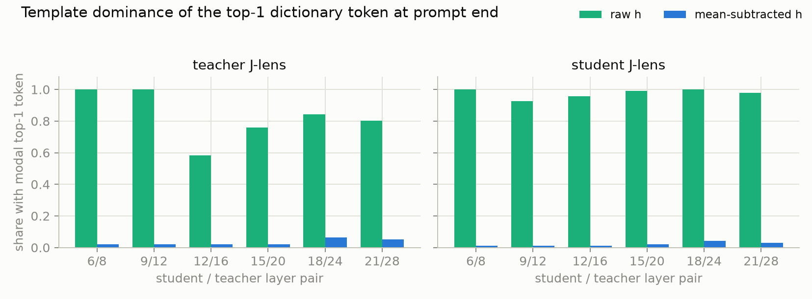
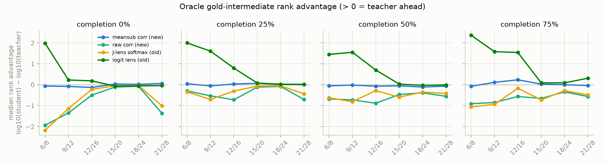
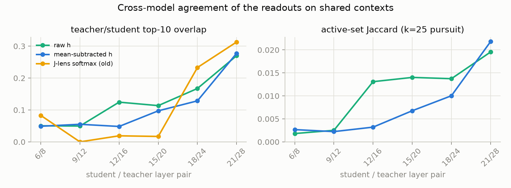
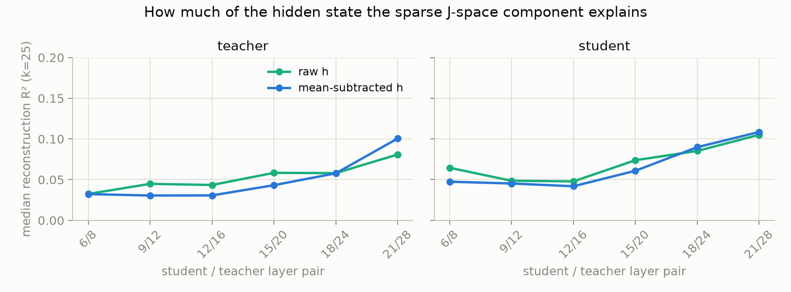

# Teacher / student 稀疏 J-space 分解离线诊断

日期：2026-07-14

Worktree：`/home/duanyll/opdlens/.claude/worktrees/jlens-sparse-decomp`（branch `worktree-jlens-sparse-decomp`）

本实验是 [lens-concept-injection-case-study.md](lens-concept-injection-case-study.md) 的直接后续。
它回答一个具体的立项问题：**在把 Arm E 的 dense vocabulary KL 换成 Anthropic 定义的
sparse J-space component 对齐之前，两个前置条件（gate）是否成立？**

1. **Gate 1（problem specificity）**：稀疏非负分解加 same-template mean subtraction
   能否消除 raw readout 中的模板支配？
2. **Gate 2（teacher 信号）**：去掉模板伪影之后，teacher 的 J-space 读数中是否存在
   student 缺少的、与 oracle gold intermediate 相关的信号？

没有修改任何 eval 组件；没有训练任何模型；全部计算在旧 case study 已有的 96 道
GSM8K shared contexts 上离线完成。

## 1. 结论先行

1. **Gate 1 通过，且效果非常干净。** same-template mean subtraction 把每层 top-1
   dictionary token 的跨题集中度从 56–96/96 降到 1–6/96，把同一模型内 k=25 active set
   的跨题 Jaccard 从 0.30–0.60 降到约 0.002。原因是结构性的：在 prompt end，同模板
   均值方向占 hidden 范数的 **82–96%**——raw J-lens 读的几乎全是所有题共享的模板
   分量。任何未来基于 lens 的 selector 都应把 context contrast 作为必备预处理。
2. **Gate 2 失败，且是三重失败。**
   - **Rank：去均值后信号归零，而不是翻正。** 24 个（深度 × 时间点）cell 的 teacher
     rank advantage 中位数全部落在 −0.13 到 +0.23 之间（raw 变体为 −1.94 到 −0.08，
     全负，复现旧报告）。更关键的是**绝对** rank：去均值后 oracle concept 的中位
     rank 在 100k–143k，而 242,205 个候选原子的机会水平约为 121k——teacher 和
     student **都在 chance 水平**。旧报告中 raw 全负的"student 优势"由此被证明是
     模板/readout 几何伪影，而不是 student 真的读得更好。
   - **Membership：稀疏 label 集几乎从不包含 oracle concept。** 1,134 个
     concept-context 对中，gold intermediate 进入 teacher k=25 active set 的比例为
     0.44%（raw 变体 0.0%）。这约为机会水平（~0.02%）的 20 倍，但绝对量意味着一个
     sparse classification 目标在 99.6% 的机会上给出的 label 与任务无关。
   - **Identification：跨模型 active set 几乎不相交。** 在完全相同的 context 上，
     teacher / student 的 k=25 active set Jaccard 只有 0.002–0.022；稀疏化没有改善
     旧报告的 top-10 overlap 结论（raw 0.05–0.27 对旧 softmax 0.08–0.31，同量级）。
3. **分解本身的性质与 Anthropic 报告一致，说明失败不是实现错误。** k=25 重构的
   R² 中位数只有 3–11%（Anthropic：J-space 分量 "never more than 10%" 的激活方差），
   随深度单调上升；去均值后 leading coefficient 比 raw 小约一个数量级。
4. **因此不建议实现 sparse J-space alignment 训练 arm。** 这个负结果同时波及
   [lens-sparse-concept-supervision.md](lens-sparse-concept-supervision.md) 的全部三个
   方案在 GSM8K 上以 teacher J-lens 为 selector 的版本：方案 A、B 直接依赖该 selector，
   方案 C 的 report label 也来自它。数据中仍然存在的唯一正信号还是旧报告发现的
   **浅层 teacher logit lens** 的 oracle rank advantage（+1.5 到 +2.4 个数量级）；
   加上本实验证明 mean subtraction 可以廉价消除模板伪影，下一步应当把
   context contrast 与浅层 logit lens / task-refit lens 组合，而不是继续加深
   J-lens readout 的对齐形式。

## 2. 实验协议

### 2.1 数据与模型

与注入 case study 完全一致，直接复用其 screen 产物（无需重新生成 rollout）：

| 项目 | 设置 |
|---|---|
| 数据 | GSM8K test 按 seed 42 抽取的 96 道题（outcome：67 both-correct / 17 teacher-only / 11 both-wrong / 1 student-only） |
| Teacher / Student | `Qwen/Qwen3.5-9B` / `Qwen/Qwen3.5-2B`，均为未训练 base checkpoint |
| Teacher J-lens | `/gdata/users/duanyll/jlens/qwen3p5_9b_v2/lens.pt` |
| Student J-lens | `/gdata/users/duanyll/opdlens/artifacts/qwen3p5-2b-jlens-cot-ext.pt` |
| 配对层 student / teacher | 6/8、9/12、12/16、15/20、18/24、21/28 |
| 读取位置 | 96 题 prompt end；17 个 teacher-only case 另取 student 错误 completion 的 25%、50%、75% checkpoint（共 147 个 shared contexts，最后一个 position） |

### 2.2 J-lens 字典与 token 过滤

Anthropic 将 layer $\ell$ 的 J-lens vectors 定义为 $W_U J_\ell$ 的行。计入 final
RMSNorm 的逐维权重 $\gamma$ 后，本实验使用的 residual-space 字典为：

$$
v_{\ell,t} = J_\ell^\top\left(\gamma \odot W_U[t,:]^\top\right),
$$

即模型自己的 readout 在 layer $\ell$ 坐标下的 pullback 方向（与注入 case study 第 7 节
一致），选择前对每行做 L2 归一化。按
[lens-sparse-concept-supervision.md](lens-sparse-concept-supervision.md) 第 2 节的规则
过滤字典：去掉 special/control token、纯空白、纯标点和 byte-fallback 碎片，保留任意
文字、数字和一个小的运算符白名单。Qwen3.5 词表 248,320 中保留 **242,205** 个原子。
`Step`、`Here`、`推理` 这类模板词**刻意保留**——它们是否被去均值降权正是 gate 1 要测
的内容。

### 2.3 稀疏非负分解

对每个 (context, layer, model)，用非负 gradient pursuit 求

$$
h \approx \sum_{t \in S} c_t\, \hat v_{\ell,t},\qquad c_t \ge 0,\ |S| \le k,
$$

贪心选择与当前残差正相关最大的原子，每步在当前 active set 上用投影梯度解 NNLS
（200 步），直至 $k_{\max}=25$ 或无正相关原子；同时记录嵌套的 $k=10$ 快照。这对应
Anthropic 的 "sparse non-negative combination of k J-lens vectors that best
reconstructs $h_\ell$"（他们典型取 $k \le 25$）。

### 2.4 Same-template mean subtraction

每个 context 的对照基线是**同模板、不同题**的 leave-one-out 均值：

$$
\tilde h_x = h_x - \frac{1}{|\mathcal B|}\sum_{x' \in \mathcal B,\, x' \ne x} h_{x'},
$$

prompt-end 组 $|\mathcal B| = 95$；25/50/75% checkpoint 组各为同组 teacher-only case
（$|\mathcal B| = 16$）。这同时实现了注入 case study 第 9.1 节建议的
context-contrastive term 和 Anthropic concept-vector 的 mean-subtraction 预处理思想。
`raw` 与 `meansub` 两个变体在完全相同的字典与算法下并行计算。

### 2.5 判据

- **Gate 1**：top-1 原子的跨题 modal 集中度；k=25 active set 的跨题平均 Jaccard。
- **Gate 2**：oracle gold-intermediate（与旧 case study 相同的机械提取规则，排除已在
  prefix 中出现的 concept 与 final answer）在 242k 字典上的相关 rank、teacher/student
  rank advantage $A=\log_{10}(r_s+1)-\log_{10}(r_t+1)$、进入 active set 的比例，以及
  跨模型 active set 重叠。

## 3. Gate 1：模板支配与去均值

### 3.1 Modal top-1 token

prompt end、96 题、每格为「modal token 出现次数/96」：

| 配对深度 | Teacher raw | Teacher meansub | Student raw | Student meansub |
|---|---|---|---|---|
| 6/8 | `构建` 96 | ` Ginger` 2 | `首先` 96 | ` readme` 1 |
| 9/12 | `构建` 96 | `ストラ` 2 | `为了使` 89 | `それに` 1 |
| 12/16 | `解题` 56 | `像是` 2 | `以下步骤` 92 | ` ήδη` 1 |
| 15/20 | ` Schritt` 73 | ` казалось` 2 | `解题` 95 | ` Nhận` 2 |
| 18/24 | ` étape` 81 | `设` 6 | `Here` 96 | ` let` 4 |
| 21/28 | ` reasoning` 77 | `设` 5 | `To` 94 | `Sh` 3 |

raw 变体在相关空间里完整复现了旧报告第 3 节的现象（student `Here` 96/96、`To`
94/96）。去均值后没有任何 token 在超过 6% 的题上重复登顶。

### 3.2 Active set 的跨题重合与范数占比

k=25 active set 的跨题平均 Jaccard，以及去均值残差范数占 raw 范数的中位比例：

| 配对深度 | Teacher Jaccard raw / meansub | Student Jaccard raw / meansub | Teacher \|h̃\|/\|h\| | Student \|h̃\|/\|h\| |
|---|---:|---:|---:|---:|
| 6/8 | 0.331 / 0.003 | 0.372 / 0.001 | 4.2% | 4.6% |
| 9/12 | 0.387 / 0.002 | 0.600 / 0.001 | 6.0% | 5.4% |
| 12/16 | 0.301 / 0.003 | 0.447 / 0.001 | 8.0% | 8.1% |
| 15/20 | 0.345 / 0.002 | 0.457 / 0.001 | 10.9% | 9.0% |
| 18/24 | 0.365 / 0.002 | 0.437 / 0.001 | 12.9% | 9.9% |
| 21/28 | 0.295 / 0.002 | 0.428 / 0.001 | 17.7% | 14.2% |

raw 分解有 30–60% 的原子跨题共享；而这些共享方向承载了 82–96% 的 hidden 范数。
值得注意的是，raw pursuit 的高频共享原子并不是可读的模板词，而是像
`洁白`(99%)、`崇`(93%)、` Maze`(80%)（teacher 12/16）或 ` Sebenarnya`(100%)、
`단계`(100%)（student 18/24）这样的乱码 token——非负重构用词表长尾原子的组合去拟合
同一个模板方向。这一点本身就反对把 raw active set 当作 concept inventory。

### 3.3 去均值后残余原子的定性检查

teacher、pair 12/16 与 15/20、prompt end 的三道例题（pursuit 按系数排序的前 5 原子）：

| 题 / 层 | raw pursuit top | meansub pursuit top |
|---|---|---|
| #56, 12/16 | `操作步骤` 1.53, `逐一` 1.46, ` Conan` 1.22 | `翔` 0.11, `&apos` 0.10, `松软` 0.10 |
| #56, 15/20 | ` Schritt` 3.87, `首先` 3.84, `Calc` 2.92 | `如果要` 0.32, `每一步` 0.30, `应先` 0.30 |
| #80, 15/20 | `首先` 3.90, `接` 3.05, `一步步` 3.01 | `分` 0.26, `一步一步` 0.25, `的全过程` 0.23 |
| #86, 15/20 | `首先` 3.40, ` Schritt` 3.20, `接` 2.88 | `依据` 0.25, ` bog` 0.22, `诗情` 0.21 |

去均值残差的分解系数比 raw 小约一个数量级，内容以不可解释的长尾 token 为主，偶尔
夹杂弱程序性词（`每一步`、`依据`、`所以`），**没有出现题目特异的数值或运算
concept**。Gate 1 的通过只说明模板伪影被移除了；移除之后剩下的 J-space 内容并没有
变成干净的 task concept inventory。

## 4. Gate 2a：oracle concept 的 rank 信号

teacher rank advantage 中位数（$>0$ 为 teacher 领先；new = 本实验相关 rank，
old = 注入 case study 的 softmax rank，重算值与旧报告第 5 节一致）：

| Lens / 时间点 | 6/8 | 9/12 | 12/16 | 15/20 | 18/24 | 21/28 |
|---|---:|---:|---:|---:|---:|---:|
| meansub corr / 0% | -0.07 | -0.08 | -0.13 | +0.03 | +0.02 | +0.06 |
| meansub corr / 25% | +0.04 | -0.06 | +0.03 | +0.06 | +0.01 | +0.00 |
| meansub corr / 50% | -0.06 | -0.02 | -0.07 | -0.05 | -0.11 | -0.07 |
| meansub corr / 75% | -0.08 | +0.11 | +0.23 | +0.03 | -0.00 | -0.04 |
| raw corr / 0% | -1.94 | -1.35 | -0.50 | -0.11 | -0.08 | -1.37 |
| raw corr / 75% | -0.91 | -0.85 | -0.56 | -0.66 | -0.34 | -0.57 |
| J-lens softmax (old) / 0% | -2.18 | -1.14 | -0.22 | -0.05 | -0.04 | -1.01 |
| Logit lens (old) / 0% | +1.98 | +0.23 | +0.18 | -0.07 | -0.06 | -0.05 |
| Logit lens (old) / 75% | +2.36 | +1.58 | +1.54 | +0.09 | +0.09 | +0.31 |

去均值后 advantage 归零（各 cell 的 teacher 领先比例在 0.25–0.83 间围绕 0.5 波动，
样本量 12–146）。归零的原因由**绝对** rank 揭示（prompt end、242,205 个有效原子、
机会水平中位 rank ≈ 121k）：

| Role / variant | 6/8 | 9/12 | 12/16 | 15/20 | 18/24 | 21/28 |
|---|---:|---:|---:|---:|---:|---:|
| teacher raw | 222k | 239k | 236k | 240k | 231k | 196k |
| teacher meansub | 126k | 136k | 143k | 129k | 103k | 100k |
| student raw | 2.7k | 10.6k | 76k | 185k | 192k | 9.2k |
| student meansub | 108k | 108k | 125k | 127k | 111k | 100k |

三个观察：

1. teacher raw 的 rank 比 chance 还差——模板方向支配相关读数并把数值类原子推向
   榜尾；
2. student raw 在浅层的"好 rank"（2.7k–10.6k）在去均值后消失，证明它是 readout
   几何伪影而不是真实的 concept 读出，旧报告 24 个 cell 全负的结论由此得到解释；
3. 去均值后双方都落在 chance 附近：**残差 J-lens 相关读数中不含 oracle concept
   信息**。这不是"teacher 和 student 一样好"，而是"两侧都没有信号"。

浅层 teacher logit lens（旧数据）仍是全部对比中唯一的强正信号。

## 5. Gate 2b：oracle concept 进入稀疏分解的比例

1,134 个 eligible concept-context 对（全部时间点与深度合并）：

| Variant | Teacher k=25 | Teacher k=10 | Student k=25 | Teacher-only | 双方都有 |
|---|---:|---:|---:|---:|---:|
| raw | 0.00% | 0.00% | 0.26% | 0.00% | 0.00% |
| meansub | 0.44% | 0.35% | 0.18% | 0.26% | 0.18% |

单个 concept（约 1–2 个 tokenizer variant）随机进入 k=25 active set 的机会水平约为
0.01–0.02%。0.44% 高于 chance，但作为监督信号意味着：假如把 teacher 稀疏分解直接
做成 label，**99.6% 的 accepted 位置给出的 label 与 oracle 任务结构无关**。

## 6. Gate 2c：跨模型 identification

147 个 shared contexts 上的平均：

| 配对深度 | top-10 overlap raw / meansub / old softmax | active-set Jaccard raw / meansub |
|---|---:|---:|
| 6/8 | 0.050 / 0.049 / 0.083 | 0.002 / 0.003 |
| 9/12 | 0.050 / 0.055 / 0.000 | 0.003 / 0.002 |
| 12/16 | 0.124 / 0.048 / 0.019 | 0.013 / 0.003 |
| 15/20 | 0.114 / 0.097 / 0.017 | 0.014 / 0.007 |
| 18/24 | 0.167 / 0.129 / 0.233 | 0.014 / 0.010 |
| 21/28 | 0.270 / 0.278 / 0.313 | 0.020 / 0.022 |

稀疏化与去均值都没有改变旧报告第 9.4 节的结论：workspace band 的 teacher / student
读出内容几乎不相交，只在靠近输出的层部分收敛。对齐"teacher 的稀疏分量"仍然缺少
跨模型 identification 的基础。

## 7. 分解本身的性质（实现 sanity）

k=25 重构 R² 的中位数（prompt end）：

| Role / variant | 6/8 | 9/12 | 12/16 | 15/20 | 18/24 | 21/28 |
|---|---:|---:|---:|---:|---:|---:|
| teacher raw | 0.032 | 0.045 | 0.043 | 0.058 | 0.058 | 0.081 |
| teacher meansub | 0.032 | 0.030 | 0.031 | 0.043 | 0.058 | 0.101 |
| student raw | 0.065 | 0.049 | 0.048 | 0.074 | 0.085 | 0.105 |
| student meansub | 0.047 | 0.045 | 0.042 | 0.061 | 0.090 | 0.109 |

数值与 Anthropic 报告的 "J-space 分量 never more than 10% of activation variance"
一致，且随深度单调上升——分解实现本身的行为符合原文预期，gate 2 的失败不能归因于
实现错误。

## 8. 对训练方案的含义

1. **不实现 sparse J-space alignment arm。** 它要修的两个病灶（dense tail、scale
   gauge）是真实的，但本诊断显示在 GSM8K 上其 label 源头没有信号：oracle rank 在
   chance 水平、membership 0.44%、跨模型 active set 不相交。三个 gate 判据两个失败。
2. **这个负结果同时覆盖以 teacher J-lens 为 selector 的方案 A、B、C。**
   方案 C 的训练机制（真实 output path）仍然是三者中最健壮的，但它的 label 也来自
   同一个 selector；在 J-lens 读不出题目特异 concept 的 setting 里，三个方案都会把
   算力花在与任务无关的 label 上。若要保留方案 C 的机制，需要先换一个有信号的
   label 源。
3. **Mean subtraction 应成为任何 lens-based gate 的必备预处理。** 它用一次均值
   计算消除了占 hidden 范数 82–96% 的模板分量，代价可忽略。旧报告第 9.1 节的
   context-contrastive 建议由此得到定量确认——但也必须接受它的第二个教训：去掉
   伪影之后剩下的不一定是信号。
4. **下一个最有希望的 label 源是浅层 teacher logit lens。** 它在旧数据的 oracle
   advantage（+1.5 到 +2.4）在本轮所有对比中仍然独一无二。它的 raw top tokens 不可
   解释，但本诊断的方法直接给出改造路径：把 readout 限制在候选 concept 子集上
   （数值 intermediate 与运算词只有数千个原子），叠加 mean subtraction，然后按
   注入 case study 第 10 节的受控 two-hop coordinate-swap benchmark 验证因果性。
5. **J_task / J_onpolicy 重拟合仍未被本实验排除。** 两个 lens artifact 都是现成的
   （teacher v2 语料、student GSM8K CoT 扩展语料），
   [lens-methods-and-invariants.md](lens-methods-and-invariants.md) 第 7 节的三分
   校准实验（broad / task / on-policy）可以检验 gate 2 的失败是否部分来自校准语料。
   但在浅层 logit lens 已有正信号的情况下，它的优先级应低于第 4 点。

## 9. Reproducibility 与局限

实验脚本位于 worktree：
`/home/duanyll/opdlens/.claude/worktrees/jlens-sparse-decomp/experiments/jlens_sparse_decomp/`
（`common.py`、`run_role.py`、`metrics.py`、`plot.py`）。raw outputs 位于
`/gdata/users/duanyll/opdlens/jlens-sparse/`。

| 阶段 | Slurm job | 资源 | 时间 |
|---|---:|---|---:|
| Teacher capture + 分解 | 4568 | a800，A800 | 9m26s |
| Student capture + 分解 | 4569 | compute，24 GB 4090 | 9m39s |
| 指标聚合与图表 | — | service CPU | ~1m |

主要 raw files：

- `{teacher,student}_hiddens.pt`：147 contexts × 6 layers 的最后 position hidden；
- `{teacher,student}_decomp.jsonl`：每 (context, layer, variant) 的 top-16 相关原子、
  k=25/k=10 active set 与系数、R²；
- `{teacher,student}_concepts.jsonl`：每个 oracle concept 的相关 rank 与 membership；
- `metrics.json`：本报告全部表格的数据源。

局限：

- **单 position 读数**：只在每个 context 的最后一个 position 分解；Anthropic 的部分
  实验在全部 position 上操作。
- **LOO 基线的样本量**：25/50/75% checkpoint 组只有 16 个同伴 context，均值噪声比
  prompt-end 组（95 个）大。
- **原子归一化**：相关 rank 基于 L2 归一化原子（cosine 风格），与旧报告的 softmax
  logit rank 不同——raw 变体的数值因此与旧表略有差异，但符号与量级一致，且两种
  归一化下 raw 结论相同。
- **贪心 pursuit 是近似**：gradient pursuit 不是全局最优稀疏解；Anthropic 未公开其
  实现细节（步数、终止条件），k=25 与他们的典型上限一致但并非严格复现。
- **mean-subtraction 的基线定义与原文不同**：Anthropic 的 concept vector 对 100 个
  baseline concept 的均值做减法；本实验用同模板不同题的均值。前者对照的是"其他
  概念"，后者对照的是"其他题"——对 gate 1（模板伪影）而言本实验的定义更贴题。
- **校准语料未重拟合**：沿用现成 lens artifacts，`J_broad` / `J_onpolicy` 变体未测。
- oracle concept 仍是 gold rationale 的 lexical 近似，会漏掉 multi-token concept 与
  fused operation；96 题、1,134 个 concept 对足以排除大而干净的效应，不足以估计
  很小的平均效应。

## 10. 参考

- Anthropic, [Verbalizable Representations Form a Global Workspace in Language Models](https://transformer-circuits.pub/2026/workspace/index.html)
- Anthropic, [J-space sparse decomposition method](https://transformer-circuits.pub/2026/workspace/index.html#methods-jspace)
- 本仓库前序分析：[lens-concept-injection-case-study.md](lens-concept-injection-case-study.md)、
  [lens-sparse-concept-supervision.md](lens-sparse-concept-supervision.md)、
  [lens-gradient-readout-audit.md](lens-gradient-readout-audit.md)、
  [lens-methods-and-invariants.md](lens-methods-and-invariants.md)
